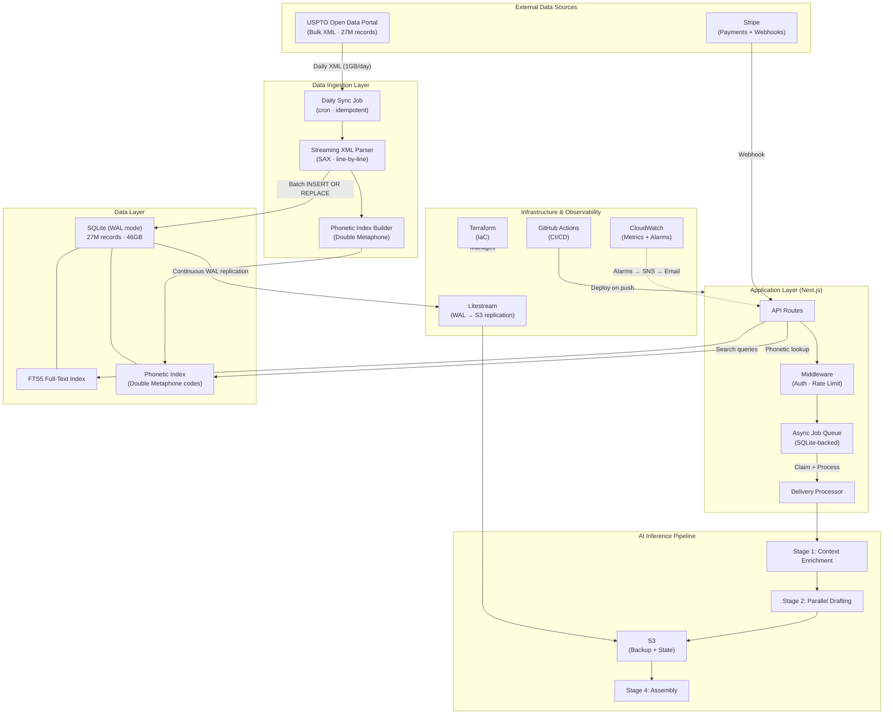
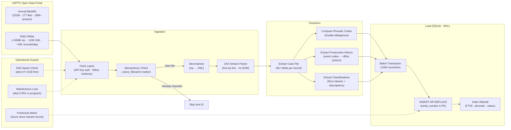
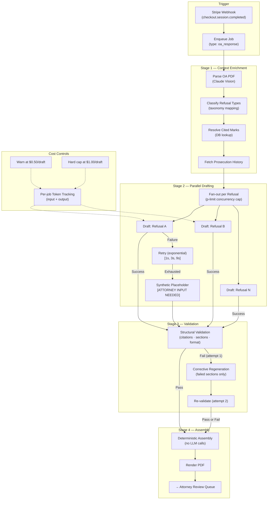
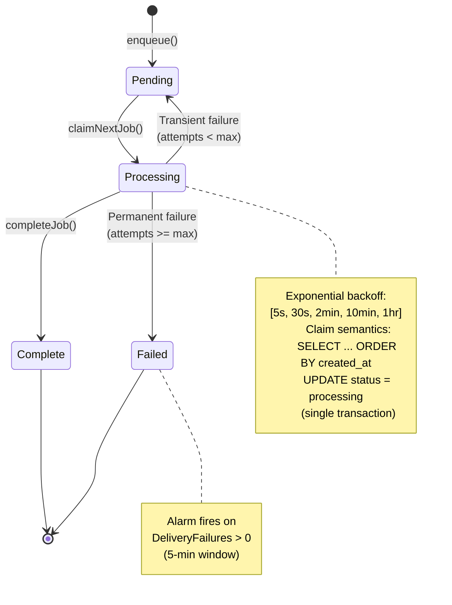
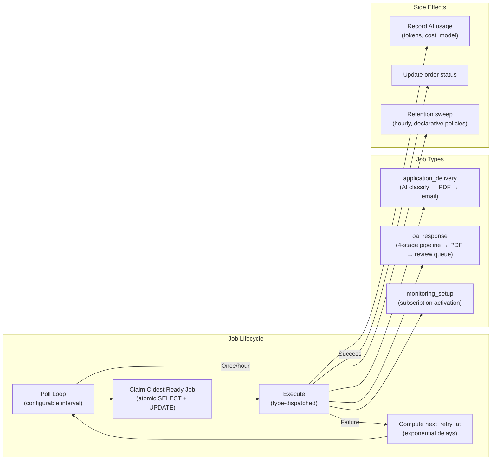
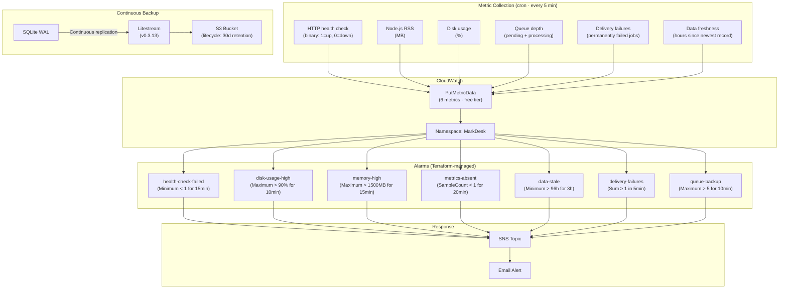
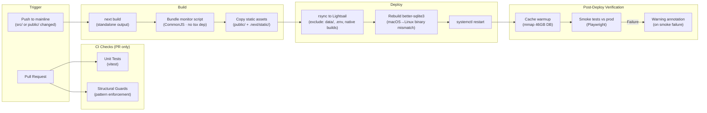
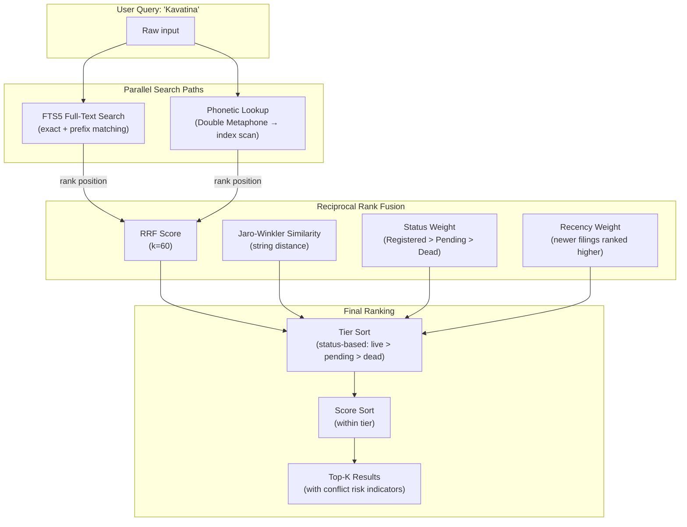
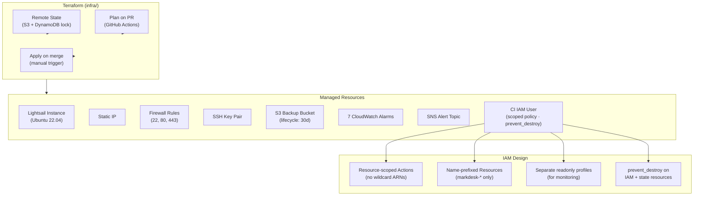

# MarkDesk: Architecture Overview

**AI-powered trademark prosecution platform.** Built and operated solo, covering data ingestion, production ML inference, and observability.

Live at [markdesk.wolff.sh](https://markdesk.wolff.sh)

---

## What It Does

MarkDesk helps small business owners file USPTO trademark applications and respond to office actions (examiner rejections). The platform:

- Ingests the full USPTO trademark register (27M+ records) from government bulk XML data
- Provides real-time clearance search with phonetic similarity matching
- Classifies marks against the USPTO Acceptable Identification of Goods and Services Manual
- Drafts office action responses via a multi-stage AI pipeline with attorney review gates
- Monitors trademark status changes and sends deadline alerts

---

## System Architecture

---

## Data Ingestion Pipeline

The USPTO publishes the full US trademark register as bulk XML. No search API exists. I built an ingestion pipeline that maintains a local replica with <48h freshness.

**Design decisions:**
- **SAX over DOM**: Daily XML files are ~1GB. DOM parsing would OOM a 2GB instance. Line-by-line streaming keeps RSS under 200MB.
- **Idempotent markers**: `.done_<filename>` files prevent re-import on cron retry or server restart. The check is a single `stat()`, no DB query needed.
- **Batch transactions**: 1000-record SQLite transactions balance write throughput (~50K inserts/sec) against WAL growth (Litestream must keep up).
- **Maintenance lock**: Long-running DDL (CREATE INDEX on 46GB DB) and daily imports cannot run concurrently because both saturate disk I/O on the single-disk instance. A lock file prevents overlap.

---

## Multi-Stage AI Inference Pipeline

Office action responses require structured legal arguments. A single LLM call can't reliably produce a complete, validated response, so the pipeline is decomposed into four stages with distinct failure modes and retry semantics.

**Design decisions:**
- **Parallel fan-out with concurrency limit**: Multiple refusals are drafted concurrently (`p-limit` semaphore) to stay within provider rate limits. `Promise.allSettled` ensures one failure doesn't discard completed work.
- **Corrective regeneration**: On validation failure, only the *failing sections* are regenerated with the validation issues injected as corrective context. One regeneration attempt maximum to prevent infinite loops.
- **Synthetic placeholders**: If generation fails after retries, a well-formed placeholder fills the slot. The document is still structurally valid and the attorney review step catches the gap. Graceful degradation over hard failure.
- **Cost tracking per job**: Every inference records input/output tokens and computes cost at the model's per-token rate. A warn threshold at $0.50 catches prompt bloat before the hard ceiling. Costs are queryable per-order for margin analysis.
- **Deterministic assembly**: Stage 4 never calls an LLM. It renders the validated drafts into the final document format. This separation means assembly is fast, cheap, and reproducible.

---

## Async Job Queue & Delivery

Payment events trigger async work (AI generation, PDF rendering, email delivery). The queue is SQLite-backed with at-least-once semantics.

**Design decisions:**
- **SQLite as queue**: At current scale (<100 jobs/day), a dedicated message broker adds operational overhead without benefit. The queue table lives in the same DB as the application, so atomic cross-table transactions (order status + queue insert) are trivial.
- **At-least-once delivery**: Jobs are idempotent. Re-processing a delivery just re-sends an email. The customer gets a duplicate at worst, never a lost order.
- **Declarative retention**: Completed/failed jobs are swept after 30 days. Retention policies are declared as a data structure, not scattered across codebase.

---

## Observability & Operational Maturity

Single-person operation demands automated detection. The system publishes 6 CloudWatch metrics (within free tier) and fires alarms for 7 failure modes.

**Design decisions:**
- **Metric budget discipline**: Only metrics consumed by alarms are shipped to CloudWatch. Diagnostic metrics (DB size, mark count, AI cost) are logged locally but not published. Avoids the $0.30/metric/month cost creep.
- **`treat_missing_data = breaching`** on health check and metrics-absent: If the cron stops running (server down, OOM kill), silence itself is the alarm signal. No "silent failure" gap.
- **Litestream over periodic snapshots**: WAL-based continuous replication means RPO is seconds, not hours. A weekly full-DB copy (`aws s3 cp` of 46GB) was eliminated after it caused disk contention and SIGBUS crashes. The continuous WAL approach is both safer and cheaper.
- **Data freshness SLA**: USPTO publishes no data Fri–Mon. The 96-hour threshold accounts for weekends without false-alarming. Three consecutive hourly breaches are required to fire, which prevents transient import delays from paging.

---

## CI/CD & Deploy Pipeline

Push-to-deploy with structural guards, platform-aware native module handling, and post-deploy verification.

**Design decisions:**
- **Structural guards**: Automated tests that grep the source tree for anti-patterns (re-inlined utilities, duplicate implementations, unauthorized constants). They enforce consolidation not through code review discipline, but through CI failure.
- **Native module rebuild on deploy**: `better-sqlite3` compiles a C++ addon. Build machine (macOS/GitHub runner) and server (Ubuntu) have different ABIs. The deploy rebuilds the native module in-place rather than shipping the whole `node_modules/`.
- **Cache warmup before smoke**: A 46GB memory-mapped SQLite DB has a cold start where first queries hit disk. The deploy warms the search path explicitly so smoke tests don't false-fail on timeout.
- **Non-blocking smoke failure**: Smoke tests run against live prod but don't roll back on failure (a rollback is riskier than investigating). Instead, a GitHub annotation flags the issue for human review.

---

## Search Architecture

Clearance search requires both exact text matching and phonetic similarity detection (trademarks that *sound alike* can conflict even if spelled differently).

**Design decisions:**
- **Dual-path search**: Exact text match catches direct conflicts; phonetic match catches sound-alikes ("Kavatina" ↔ "Cavatina"). Both are required for proper clearance. Missing either path creates false confidence.
- **Reciprocal Rank Fusion**: Merges ranked lists from different retrieval methods without needing score normalization. Simple, effective, well-studied in IR literature.
- **Status-tiered ranking**: A live registered mark (status 800) is a hard blocker regardless of textual similarity. Tier is the primary sort; score only breaks ties within a tier. This matches how trademark attorneys actually assess risk.
- **Double Metaphone over Soundex**: Soundex is English-only and loses too much information. Double Metaphone handles multi-language phonetics and produces primary + alternate codes, catching more potential conflicts.

---

## Infrastructure as Code

All cloud resources are Terraform-managed with state locking (S3 + DynamoDB), scoped IAM for CI, and prevent-destroy on critical resources.

---

## Tech Stack

| Layer | Technology | Why |
|-------|-----------|-----|
| App | Next.js 15 / TypeScript | SSR + API routes in one deployable, standalone output mode for self-hosting |
| Database | SQLite (WAL) + better-sqlite3 | 27M records, read-heavy, single-writer. No connection pooling overhead. |
| Search | FTS5 + Double Metaphone | Sub-50ms searches across 27M records with phonetic similarity |
| AI | Claude API (Anthropic SDK) | Vision for PDF parsing, text generation for drafting, structured output for classification |
| Payments | Stripe (Checkout + Webhooks) | Idempotent webhook handling with transactional order creation |
| Email | Resend | Transactional delivery notifications + monitoring alerts |
| Infra | AWS Lightsail + Terraform | Single-instance simplicity with IaC discipline |
| Backup | Litestream → S3 | Continuous WAL replication, seconds RPO |
| CI/CD | GitHub Actions | Push-to-deploy with structural guards + post-deploy smoke |
| Observability | CloudWatch (custom metrics + alarms) | 6 metrics, 7 alarms, free tier |
| Reverse Proxy | Caddy | Auto-HTTPS via Let's Encrypt, zero config TLS |

---

## Lessons Learned (Operational)

A few hard-won lessons from operating this solo:

1. **Don't `aws s3 cp` a live WAL-mode database.** Multi-hour uploads get BadDigest errors from concurrent checkpoints. Litestream's continuous replication solves this properly.

2. **Silence is a signal.** `treat_missing_data = breaching` on health metrics means a dead cron (OOM, disk full, crashed agent) alarms immediately instead of going unnoticed for hours.

3. **DDL on a single-disk instance is surgery.** A `CREATE INDEX` on 46GB competes for I/O with the live app's mmap'd reads. I wrote a DDL runbook with pre-checks (cron pause, deploy hold, disk headroom) after a SIGBUS outage taught me the hard way.

4. **Native binary mismatches are silent killers.** `better-sqlite3` built on macOS won't load on Linux. The deploy pipeline rebuilds it in-place on the server, not during the build step.

5. **Metric budget matters at small scale too.** CloudWatch charges $0.30/metric/month beyond 10. Only shipping alarmed metrics keeps the bill at $0 while diagnostic data stays in local logs.

---

## Contact

**Matthew Wolff** · [GitHub](https://github.com/matthewwolff) · [Site](https://matthewwolff.github.io)
